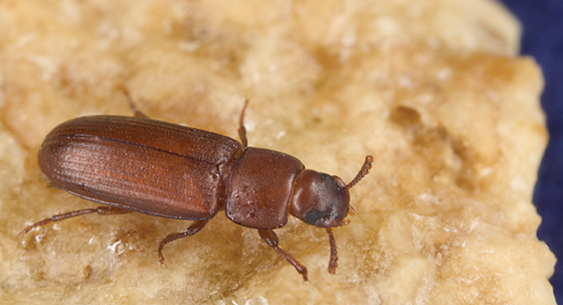
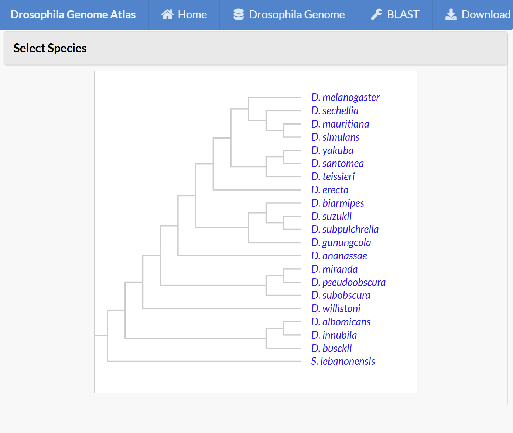

# Bug Genome Atlas

- 報告者：朱昱光  C54104719
- 科系：不分系(主修資訊工程與生命科學)
- 文本跨閱與思辨方法 TEXTUAL CROSS-READING AND ISSUE CRITICISM

<!--
開場 20-30 秒：
- 我今天要報告的是本學期論文專題規劃
- 主題是 Drosophila genome atlas
- 會分三部分：為什麼做、重要性、寫作地圖
-->

---
layout: section
---

# 1. Why

那又怎麼樣？

<!--
10 秒轉場
-->

---
layout: two-cols
---
# 昆蟲未來會大幅影響人類

- 蜜蜂數量會大幅減少：IPBES 報告指出，到 2050 年全球將有約 **40%** 的野蜂面臨滅絕威脅。
  - 全球植物數量減少，蔬果、肉品價格上升
  - 生態大幅影響
  - 棉製紡織品會數量減少、價格上升
- 蚊子、赤甲蟲數量將大幅增加：WHO(世界衛生組織)報告指出，預計到 2050 年，全球約 **49%**（近半數）的人口 將生活在埃及斑蚊與白線斑蚊棲息的區域。
  - 蚊子是世界上造成人類死亡最多的動物，每年有70~100萬人死於蚊媒病。
  - 赤擬谷盜會取食穀物的胚芽部位，導致種子發芽率喪失，導致糧倉發生大規模霉變。

::right::

   
   

---

# 為什麼做 Bug Genome Atlas？

1. 果蠅是經典模式生物，
   累積大量遺傳與發育研究資料
2. 但跨資料庫、跨物種的基因資訊仍分散，
   使用門檻高
3. 研究者需要一個可快速查詢、比對、解讀的
   整合平台

 

### 我的研究動機

- 把「資料很多但不好用」變成「資料可被快速提問與驗證」
- 以可重現的方法建立 atlas，支援後續研究與教學

<!--
約 1 分鐘：
- 先講果蠅在生命科學中的核心地位
- 再強調痛點不是「沒有資料」，而是「資料難用」
- 收斂到我的核心動機：整合 + 可用性
-->

---
layout: section
---

# 2. 重要性

81宮格

---

# 題目重要性：科學面與應用面

## 科學面

- 有助於快速定位基因功能與同源關係
- 支援基礎研究：發育、生理、演化與疾病機制探索
- 降低研究者整理資料的重工成本

## 應用面

- 提供跨物種推論基礎，可延伸到農業與病媒相關昆蟲研究
- 作為基因工程、標的篩選與後續驗證的前置資訊層
- 強化從資料到假說的轉換效率

<!--
約 1-1.5 分鐘：
- 分兩層講：先科學社群價值，再談應用潛力
- 可口語補充：此平台不是取代實驗，而是縮短假說形成時間
-->

---
layout: two-cols
---

# 目前已完成的核心工作

1. 建立資料整理流程：整合多來源基因資訊
2. 設計演算法流程：將基因資訊轉為可查詢、可比對結構
3. 開發網站介面：讓使用者可直接檢索與瀏覽結果

 

## 預期產出

- 建立可以分析21個果蠅物種與3個熱門物種的基因分析網站(已完成 21/24)
- 一篇具方法與案例的課程論文
   
::right::

<!--
約 1 分鐘：
- 讓同學知道這不是概念，而是已經做出系統雛形
-->

---
layout: section
---

# 3. 寫作地圖

我打算怎麼寫這篇專題？

---

# 寫作地圖（章節順序）

1. Methods 第3章
   - 2.1 資料如何收集與清理
   - 2.2 演算法如何推估每個基因的功能與意義
   - 2.3 平台如何建立
2. Case Study 第4章
   - 示範使用流程
   - 展示平台可產生的生物學洞見
   - 3.1 蜜蜂學家如何用這個研究蜜蜂的基因
   - 3.2 果蠅演化學家如何透過這個研究基因
3. Introduction 第2章
   - 問題背景、研究缺口、本文貢獻
4. Abstract 第1章
   - 濃縮研究目的、方法、結果與意義

<!--
約 1.5 分鐘：
- 說明為何先寫 Methods：最具體、可先固定研究骨架
- 再用 Case Study 連接方法與價值
-->

---

# 結論

- Why：解決基因資料分散、難以有效使用的痛點
- Importance：同時具備基礎研究與跨物種應用價值
- Writing Map：Methods -> Case Study -> Introduction -> Abstract

謝謝各位，歡迎給我建議。

<!--
收尾 20-30 秒
整體時間約 8-9 分鐘，可依課堂節奏拉到 10 分鐘
-->

---
# References

(1/2)

1. Ashburner, M., Ball, C. A., Blake, J. A., Botstein, D., Butler, H., Cherry, J. M., Davis, A. P., Dolinski, K., Dwight, S. S., Eppig, J. T., Harris, M. A., Hill, D. P., Issel-Tarver, L., Kasarskis, A., Lewis, S., Matese, J. C., Richardson, J. E., Ringwald, M., Rubin, G. M., & Sherlock, G. (2000). Gene Ontology: Tool for the unification of biology. Nature Genetics, 25(1), 25-29.

2. Bergman, C. M., Pfeiffer, B. D., Rincon-Limas, D. E., Hoskins, R. A., Gnirke, A., Reese, M. G., Wang, J. P., Lewis, S. E., Celniker, S. E., & Rubin, G. M. (2002). Assessing the impact of comparative genomic sequence data on the functional annotation of the Drosophila genome. Genome Biology, 3(12), research0086.1.

3. Drosophila 12 Genomes Consortium. (2007). Evolution of genes and genomes on the Drosophila phylogeny. Nature, 450(7167), 203-218.

4. Gabaldon, T., & Koonin, E. V. (2013). Functional and evolutionary implications of gene orthology. Nature Reviews Genetics, 14(5), 360-366.

5. Glover, N. M., Redestig, H., & Dessimoz, C. (2019). Advances and applications in the quest for orthologs. Molecular Biology and Evolution, 36(10), 2157-2164.

6. Kanehisa, M., & Goto, S. (2000). KEGG: Kyoto Encyclopedia of Genes and Genomes. Nucleic Acids Research, 28(1), 27-30.

7. Kanehisa, M., Furumichi, M., Sato, Y., Kawashima, M., & Ishiguro-Watanabe, M. (2023). KEGG for taxonomybased analysis of pathways and genomes. Nucleic Acids Research, 51(D1), D587-D592.

8. Kent, W. J., Sugnet, C. W., Furey, T. S., Roskin, K. M., Pringle, T. H., Zahler, A. M., & Haussler, D. (2002). The human genome browser at UCSC. Genome Research, 12(6), 996-1006.

---

# References

(2/2)

9. Kim, B. Y., Wang, J. R., Miller, D. E., Koury, S. A., Jewell, C. P., Liao, E. J., Nyunt, A. M., Kiernan, G. P., Ma, S. D., Pyo, L. S., Park, S. G., Knowles, A. S., Earl, D. A., Lipshultz, A. L., Mahadevaraju, S., Oliver, B., Nuzhdin, S. V., Granger, L. T., Erickson, J. W., ... & Kopp, A. (2021). Highly contiguous assemblies of 101 drosophilid genomes. eLife, 10, e66405.

10. Larkin, A., Marygold, S. J., Antonazzo, G., Attrill, H., Dos Santos, G., Garapati, P. V., Goodman, J. L., Gramates, L. S., Millburn, G., Strelets, V. B., Tabone, C. J., Thurmond, J., & FlyBase Consortium. (2021). FlyBase: Updates to the Drosophila melanogaster knowledge base. Nucleic Acids Research, 49(D1), D899-D907.

11. Paysan-Lafosse, T., Blum, M., Chugani, S., Grego, T., Pinto, B. L., Salazar, G. A., Bileschi, M. L., Bork, P., Bridge, A., Colwell, L., Gough, J., Haft, D. H., Letunic, I., Marchler-Bauer, A., Mi, H., Natale, D. A., Necci, M., Orengo, C. A., Pandurangan, A. P., ... & Bateman, A. (2023). InterPro in 2022. Nucleic Acids Research, 51(D1), D418-D427.

12. Singh, N. D., Larracuente, A. M., Akashi, H., & Clark, A. G. (2009). Comparative genomics on the Drosophila phylogenetic tree. Annual Review of Ecology, Evolution, and Systematics, 40, 601-626.

13. Stark, A., Lin, M. F., Kheradpour, P., Pedersen, J. S., Parts, L., Carlson, J. W., Crosby, M. A., Rasmussen, M. D., Roy, S., Deoras, A. N., Ruby, J. G., Brennecke, J., Hodges, E., Hinrichs, A. S., Caspi, A., Paten, B., Wigge, P. A., Afshar, B., Abbott, S., ... & Kellis, M. (2007). Discovery of functional elements in 12 Drosophila genomes using evolutionary signatures. Nature, 450(7167), 219-232.

14. Tegenfeldt, F., Simao, F. A., Seppey, M., & Zdobnov, E. M. (2024). OrthoDB and BUSCO update: Annotation of orthologs with wider sampling of genomes. Nucleic Acids Research, 52(D1), D397-D404.

15. Yang, T.-H., Hsu, C.-W., Wang, Y.-X., Yu, C.-H., Rathod, J., Tseng, Y.-Y., & Wu, W.-S. (2022). YMLA: A comparative platform to carry out functional enrichment analysis for multiple gene lists in yeast. Computers in Biology and Medicine, 151(Part B), 106314. https://doi.org/10.1016/j.compbiomed.2022.106314

16. Wu, W.-S., Wang, L.-J., Yen, H.-C., & Tseng, Y.-Y. (2020). YQFC: a web tool to compare quantitative biological features between two yeast gene lists. Database, 2020, baaa076. https://doi.org/10.1093/database/baaa076

